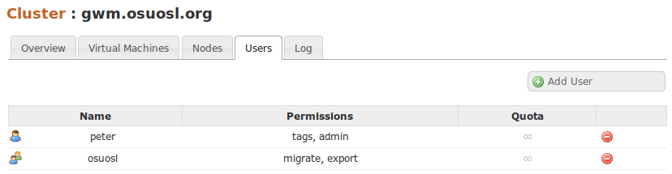
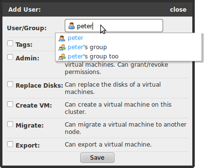

!SLIDE center

# Permissions

!SLIDE center rvc

# Personas
### Users can act on behalf of groups

!SLIDE center bullets list

# Ownership 
# vs. 
# Permissions
* Ownership is for book keeping
* Permissions let you do things

!SLIDE center

# Users Tab

!SLIDE center

# Editing Users

