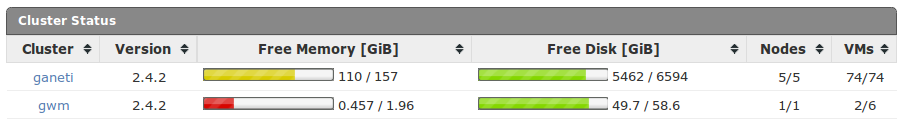
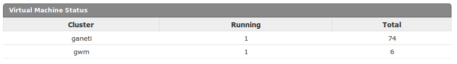
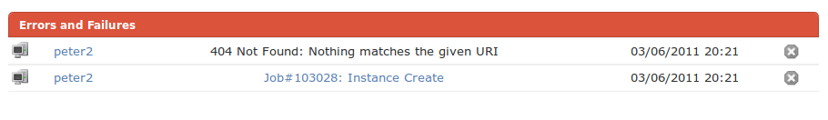

!SLIDE smbullets list transition=fade

# Overview

* Cluster Status
* Instance Status
* Resource Usage
* Errors
* Admin Tasks

!SLIDE center transition=fade

# Cluster Status

!SLIDE center transition=fade

# Instance Status

!SLIDE center transition=fade

# Resource Usage

TODO: image here

!SLIDE center transition=fade

# ERRORS

