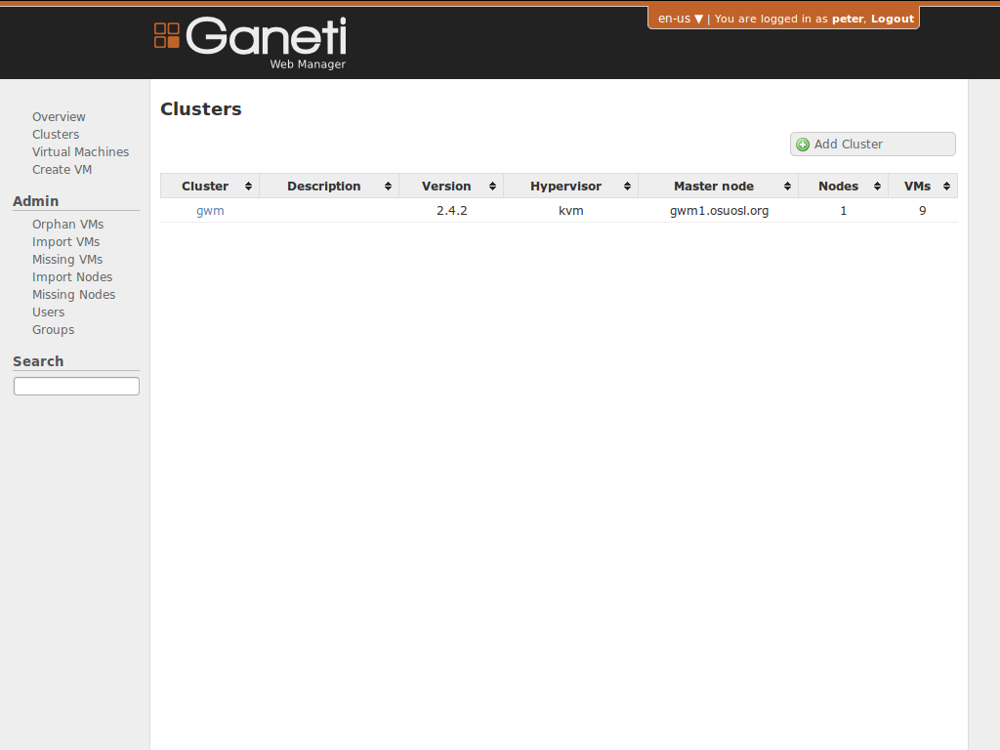

!SLIDE full-screen-img center transition=fade

!SLIDE bullets list transition=fade

# Import Tools

* Find Orphaned Instances
* Import New Nodes & Instances
* Remove Deleted Nodes & Instances

!SLIDE commandline medcode rvc incremental transition=fade

# Cache Updater
### Imports Nodes and Virtual Machines too

    $ twistd --pidfile=cache.pid gwm_cache
