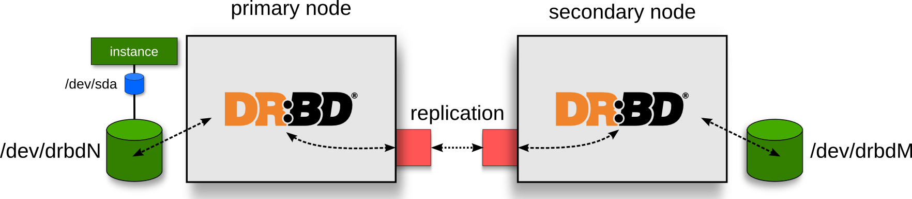

!SLIDE limg center bullets

# DRBD Architecture

* **RAID1** over the network

!SLIDE bullets list

# Installing DRBD

* Required for _high availability_
* Can _upgrade_ non-HA to DRBD later
* Need at least _>=drbd-8.0.12_
* Depends on distro Support
* Included in _mainline_

!SLIDE codeblock rvc

# DRBD Setup

### Installation

    $ apt-get install drbd8-utils

### Via modules

    $ echo drbd minor_count=255 usermode_helper=/bin/true >> /etc/modules
    $ depmod -a
    $ modprobe drbd minor_count=255 usermode_helper=/bin/true

### Via Grub

    # Kernel Commands
    drbd.minor_count=255 drbd.usermode_helper=/bin/true
