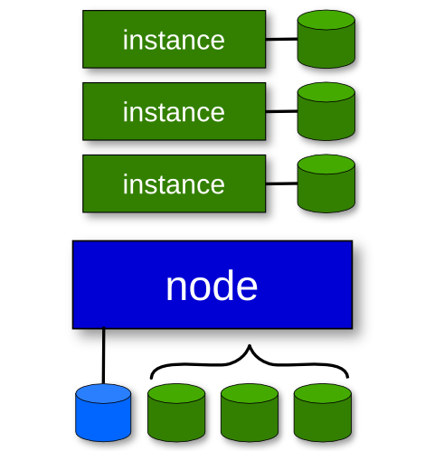

!SLIDE center bullets list smimg smtitle

# Instances

* Virtual machine that _runs_ on the cluster
* _fault tolerant/HA_ entity within cluster

!SLIDE bullets redcode list

# Instance Parameters

* Hypervisor (called `hvparams`)
* General (called `beparams`)
* Networking (called `nicparams`)
* Modified via instance or cluster defaults

!SLIDE bullets list

# Disk template

* **drbd** : LVM + DRBD between 2 nodes
* **plain** : LVM w/ no redundancy
* **file** : Plain files, no redundancy
* **diskless** : Special purposes
