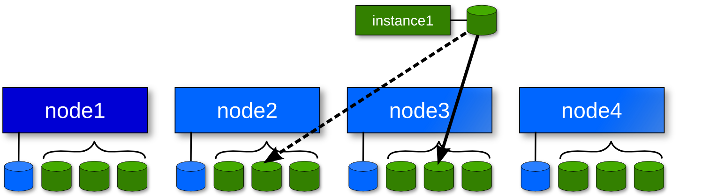

!SLIDE bullets list redcode

# IAllocator

* Automatic placement of instances
* Eliminates manual node specification
* **htools**
* External scripts used to compute

!SLIDE smtitle bullets list himg center

# _Primary_ & _Secondary_ concepts

* Instances always runs on _primary_
* Uses secondary node for _disk replication_
* Depends on _disk template_ (i.e. drbd)
